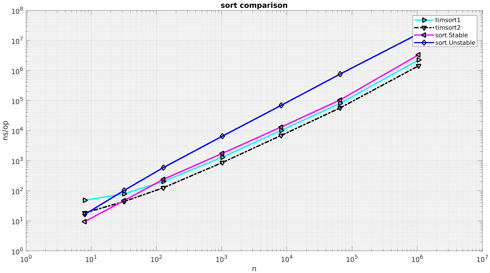
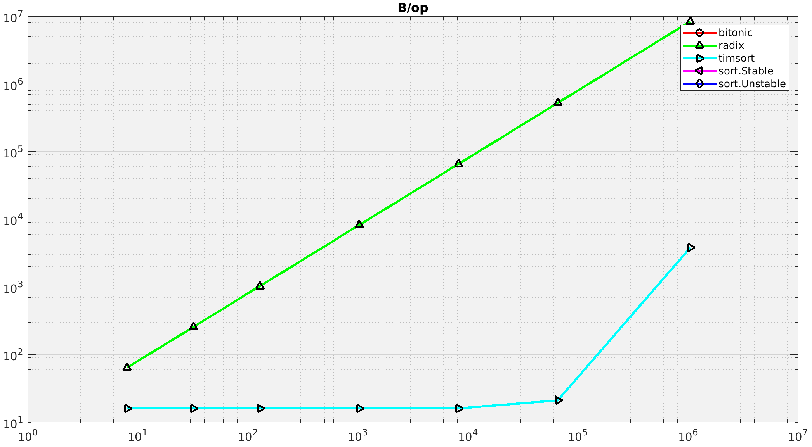
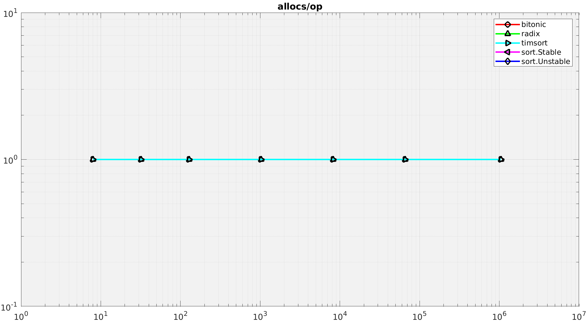

Collection of Go sorting algorithms and experiments.

Plots are log-log on both axes. My crude TimSort implementation does surprisingly well.





## Notes

The original goal of this project was to implement minimal versions of **timsort** and **pdqsort** and validate their performance improvement over standard mergesort and quicksort. It includes many search algorithms copied or adapted from Go's [pkg/sort](https://golang.org/src/sort/sort.go).

Many implementations are for `[]int`, but some are for `sort.Interface` to enable quicksort killer adversary testing.

Lessons learned:

1. sort.Sort in pkg/sort (QuickSort2 in this package) is introsort
2. sort.Stable in pkg/sort (MergeSort2 in this package) is block-insertion-sort-plus-merge - not very dissimilar to TimSort, but with fixed-size blocks instead of different-sized already-ordered runs
3. Implementing a basic form of TimSort without galloping or magic constants was actually rather intuitive and led to good performance gains by leveraging the symMerge (in-place merge) routine already implemented for sort.Stable in pkg/sort
4. The Block Quicksort modification of pdqsort gives worse performance in Go

Here's a conclusion from a different go-pdqsort implementation that might explain it:

>From the result the pattern defeating sort is much slower than the sort from standrad library. It is expected since go's memory layout is mainly heap managed and it is very different from what's in C++ and Rust. Therefore the key invention from pdqsort to reduce the cpu branch prediction is not impactful on speed, and slowing down due to more memory access.

\- https://github.com/MnO2/go-pdqsort

So far the notable implementations of pdqsort have been the [original in C++](https://github.com/orlp/pdqsort) and the [Rust implementation](https://github.com/stjepang/pdqsort).

5. The bad partition/pattern busting part of pdqsort has a good performance boost over a standard CLRS quicksort with bad partition selection

```
sevagh:go-sort $ go test -benchmem -run=^a -bench='.*(QuickSort1|PdqSort1).*Random(8192|65536)$' -v
goos: linux
goarch: amd64
pkg: github.com/sevagh/go-sort
BenchmarkPdqSort1Random8192-8               3015            383876 ns/op               0 B/op          0 allocs/op
BenchmarkPdqSort1Random65536-8               121           9831749 ns/op               0 B/op          0 allocs/op
BenchmarkQuickSort1Random8192-8              100          25272420 ns/op               0 B/op          0 allocs/op
BenchmarkQuickSort1Random65536-8             100        1673251259 ns/op               0 B/op          0 allocs/op
PASS
ok      github.com/sevagh/go-sort       173.248s
```

6. Overall pdqsort is more difficult to implement than timsort
7. The embedded [bigO](./bigO) library for least squares fitting BigO estimation is a good method of validating or verifying any of the implemented algorithms:

```
sevagh:go-sort $ go test -v -count=1 -run='BigO'
=== RUN   TestBigOTimSort
--- PASS: TestBigOTimSort (4.32s)
    bigo_test.go:27: O(Nlg(N))
=== RUN   TestBigOQuickSort1WorstCase
--- PASS: TestBigOQuickSort1WorstCase (0.00s)
    bigo_test.go:46: O(N^2)
=== RUN   TestBigOInsertionSortAscending
--- PASS: TestBigOInsertionSortAscending (0.00s)
    bigo_test.go:65: O(N^2)
=== RUN   TestBigOInsertionSortRandom
--- PASS: TestBigOInsertionSortRandom (0.00s)
    bigo_test.go:84: O(Nlg(N))
PASS
ok      github.com/sevagh/go-sort       4.328s
```

E.g. showing that the pattern-busting of PdqSort1 (that's essentially only just bolted onto QuickSort1) reduces the worst case O(N^2):

```
sevagh:go-sort $ go test -v -count=1 -run='WorstCase'
=== RUN   TestBigOQuickSort1WorstCase
--- PASS: TestBigOQuickSort1WorstCase (0.00s)
    bigo_test.go:46: O(N^2)
=== RUN   TestBigOPdqSort1WorstCaseQuickSort
--- PASS: TestBigOPdqSort1WorstCaseQuickSort (0.00s)
    bigo_test.go:103: O(N)
PASS
ok      github.com/sevagh/go-sort       0.002s
```

8. I learned of the [killer adversary for quicksort](https://www.cs.dartmouth.edu/~doug/mdmspe.pdf), which is implemented in [sort_test.go](https://github.com/golang/go/blob/master/src/sort/sort_test.go#L456) in the Golang stdlib pkg/sort (and copied here in adversary_test.go). Verification with a handful of `sort.Interface`-based versions of QuickSort and PdqSort:

```
sevagh:go-sort $ go test -v -run 'Adversary'
=== RUN   TestQuickSortIface1Adversary
--- FAIL: TestQuickSortIface1Adversary (0.00s)
    adversary_test.go:24: used 560000 comparisons sorting adversary data with size 10000
=== RUN   TestPdqSortIface1Adversary
--- FAIL: TestPdqSortIface1Adversary (0.00s)
    adversary_test.go:24: used 560000 comparisons sorting adversary data with size 10000
=== RUN   TestAdversaryStdSort
--- PASS: TestAdversaryStdSort (0.00s)
FAIL
exit status 1
FAIL    github.com/sevagh/go-sort       0.011s
```

Here we see `sort.Sort`, which is introsort (QuickSort2 in this project), does well. QuickSort1 is obviously vulnerable. PdqSort1 with its bad partition busting is still not clever enough to escape the killer adversary.

Given the direct `[]int` implementation of all the algorithms here, the caller has no control on the implementation of the sort interface (namely the Less method), so the killer adversary is irrelevant.
